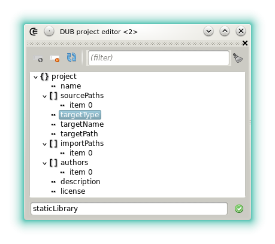



### DUB project editor

The DUB project editor allows to edit, add and remove properties of DUB projects that has the [JSON format](http://code.dlang.org/package-format?lang=json).
DUB projects with the [SDL format](http://code.dlang.org/package-format?lang=sdl) are read only.

A property value can be modified in the field at the bottom. New values always require an extra validation.
New properties can be added or removed:

- : Removes the selected property. Note that the effect is not reflected until the project is saved as a file (since Coedit does not communicate directly with DUB).
- : Shows a small dialog that allows to add a new value, a new array or a new object.

There's two ways to add a property:

* Type the property name and select its JSON type.
* Select a property name in the combo box.

When the second method is used the property type is selected automatically, which is safer.
The property name is not always required. For example when when an array item is added the content of the field is ignored.
After adding a property, its value still needs to be set at the bottom of the tree.