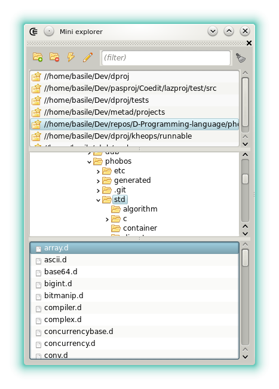
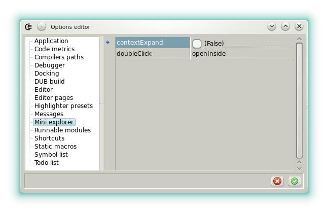

### Mini explorer

#### Description

The mini explorer provides basic file browsing within the IDE.

- : Adds the selected folder to the favorites.
- : Removes the selected favorite folder.
- : Open the selected folder or execute the selected file using the shell.
-  : If the selected file is a CE or a DUB project then opens it as a project otherwise opens it in a new code editor.
- ***input field***: filter the files whose name contains the text typed.

The file list supports drag and drop.

#### Options

A few options are available in the [option editor](widgets_options_editor).

- **contextExpands**: If checked then the tree auto expands to the folder that contains the source or the project file that's been selected.
- **doubleClick**: Defines what happens when a file is double clicked.